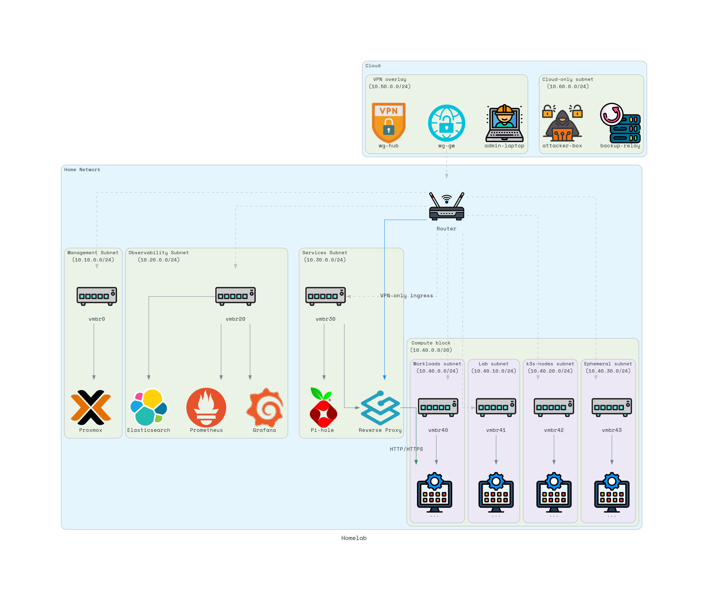

# How It Works Together

This homelab is built to be reproducible, VPN-only for ingress, and safe to rebuild.
Terraform defines infrastructure, Ansible configures hosts, and workloads live in
segmented subnets with clear trust boundaries.

## End-to-end flow

1. Remote client connects to the cloud WireGuard hub.
2. The homelab gateway maintains an outbound tunnel to the hub.
3. Traffic routes from the VPN overlay into the homelab router.
4. The router enforces inter-subnet policy and forwards to the destination subnet.
5. Services and workloads receive traffic only through allowed paths.

## Control plane vs data plane

- Control plane: Terraform creates infrastructure; Ansible applies baseline and hardening.
- Data plane: Services and apps run inside VMs/LXCs on Proxmox and are isolated by subnet.

## Network roles (high level)

- Management: Proxmox admin, bastion, and provisioning control plane.
- Observability: Logs, metrics, SIEM, and sensors.
- Services: Internal plumbing like DNS and the VPN-only reverse proxy.
- Compute block: Workloads, lab targets, k3s nodes, and ephemeral compute.

## Ingress model

- No inbound exposure to the homelab network.
- VPN-only ingress terminates at the reverse proxy in the Services subnet.
- The reverse proxy forwards HTTP/HTTPS only to the Workloads subnet.

## Operational workflow

1. Terraform provisions the cloud WireGuard hub.
2. Terraform provisions Proxmox VMs/LXCs and networks.
3. Ansible applies baseline + hardening using Terraform inventory.
4. Workloads are deployed into the appropriate subnet.

## References

- Architecture overview: `docs/architecture/overview.md`
- Diagram source: `tools/diagram.py`
- Network tree: `AGENTS.md`
